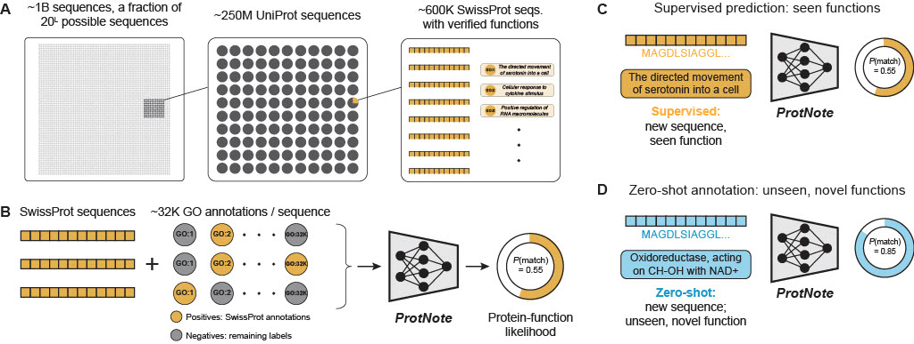

# ProtNote

## Description

Understanding protein sequence-function relationships is essential for advancing protein biology and engineering.
However, fewer than 1% of known protein sequences have human-verified functions, and scientists continually update
the set of possible functions. While deep learning methods have demonstrated promise for protein function prediction,
current models are limited to predicting only those functions on which they were trained. Here, we introduce ProtNote,
a multimodal deep learning model that leverages free-form text to enable both supervised and zero-shot protein function
prediction. ProtNote not only maintains near state-of-the-art performance for annotations in its train set, but also
generalizes to unseen and novel functions in zero-shot test settings. We envision that ProtNote will enhance protein
function discovery by enabling scientists to use free text inputs, without restriction to predefined labels – a necessary
capability for navigating the dynamic landscape of protein biology.

<p align="center">

</p>


## Table of Contents
 <!-- markdown-toc -i README.md -->

<!-- toc -->

- [Installation](#installation)
- [Config](#config)
- [Notation](#notation)
- [Data](#data)
- [Train and run inference with ProtNote](#train-and-run-inference-with-protnote)
  * [ProtNote weights](#protnote-weights)
  * [Annotations file](#annotations-file)
  * [Function description text embeddings](#function-description-text-embeddings)
  * [Datasets](#datasets)
  * [Inference](#inference)
  * [Training](#training)
- [Reproducing paper results](#reproducing-paper-results)
  * [Using our provided Zenodo data](#using-our-provided-zenodo-data)
  * [Complete Data Workflow: Download, Preprocess, and Model Output (warning: long section)](#complete-data-workflow-download-preprocess-and-model-output-warning-long-section)
    + [ProteInfer Data](#proteinfer-data)
    + [Download annotations](#download-annotations)
    + [Create zero-shot datasets, and a few more](#create-zero-shot-datasets-and-a-few-more)
    + [Generate and cache embeddings](#generate-and-cache-embeddings)
    + [ProteInfer Models](#proteinfer-models)
    + [ProtNote predictions on all test sets](#protnote-predictions-on-all-test-sets)
    + [BLAST-based predictions](#blast-based-predictions)
    + [Calculate supervised metrics](#calculate-supervised-metrics)
- [Other useful scripts](#other-useful-scripts)
  * [Latest SwissProt data](#latest-swissprot-data)
- [Contributing](#contributing)
- [Trademarks](#trademarks)

<!-- tocstop -->

## Installation
```
git clone https://github.com/microsoft/protnote.git
cd protnote
conda env create -f environment.yml
conda activate protnote
pip install -e ./  # make sure ./ is the dir including setup.py
```

## Config
Most hyperparameters and paths are managed through the `base_config.yaml`. Whenever reasonable, we enforce certain files to be in specific directories to increase consistency and reproducibility. In general, we adhere to the following data argument naming conventions in scripts: 
* Argument ending in "dir" corresponds to the full path of the folder where a file is located. E.g., data/swissprot/
* Argument ending in "path" corresponds to the full file path. E.g., data/swissprot/myfile.fasta
* Argument ending in "file" corresponds to the full file name alone (including the extension). E.g., myfile.fasta. This is used for files with enforced location within the data folder structure

## Notation
The following notes will make it easier to navigate these instructions:
* We denote user-defined inputs using all-caps text surrounded by curly braces. For example, `{DATA_SET_PATH}`, should be replaced by the user with a dataset path like `path/to/dataset`, without the curly braces.
* We refer to specific keys in the `base_config.yaml` file using this format: `KEY_NAME`. For example, `TRAIN_DATA_PATH` and `TEST_DATA_PATH` refer to the paths for the datasets used to train and test ProtNote in the supervised setting.


## Data
We train and test ProtNote with protein sequences from the SwissProt section of UniProt, corresponding to sequences with human-verified funcitons. Further, we evaluate ProtNote on different zero shot scenarios, including prediction of unseen/novel GO terms and of EC Numbers -- a type of annotation which the model was not trained on.

All the data to train and run inference with ProtNote can be downloaded using the following command:

```
TODO: Add command
```

* **data/**
    * **annotations/**: contains the text descriptions of all the GO and EC annotations for the 2019 and 2024 releases used for ProtNote.
    * **embeddings/**: stores the text description embeddings that are cached during training.
    * **models/**: holds ProtNote and ProteInfer weights for multiple seeds.
    * **swissprot/**: contains all SwissProt fasta files. 
    * **vocabularies/**: holds the 2019 and 2024 GO graphs in a simple json format, which relates each annotation with its parents.
    * **zero_shot/**: contains the datasets used in the zero-shot evaluation setting.


The names of the main datasets used in the paper are listed below. These names correspond (in most cases) to the keys in `paths/data_paths` in the `base_config.yaml`.

* `{TRAIN,VAL,TEST}_DATA_PATH`: correspond to the train, validation, and test sets used for training ProtNote. These are consistent with ProteInfer datasets.
* `TEST_DATA_PATH_ZERO_SHOT`: zero-shot dataset for unseen, novel GO terms.
* `TEST_DATA_PATH_ZERO_SHOT_LEAF_NODES`: zero-shot dataset for unseen, novel GO terms, but only for the leaf nodes of the GO graph.
* `TEST_EC_DATA_PATH_ZERO_SHOT`: zero-shot dataset of EC numbers, a dataset and type of annotation which ProtNote was not trained on.
* `TEST_2024_PINF_VOCAB_DATA_PATH`: `TEST_DATA_PATH` updated with the July 2024 GO annotations, but only including GO terms in the ProteInfer vocabulary. This dataset was used to isolate and quantify the impact of the changes in GO.
* `test_*_GO.fasta`: creates smaller test sets for runtime calculations.
* `TEST_TOP_LABELS_DATA_PATH`: a subset of `TEST_DATA_PATH`, based on a sample of sequences and only the most frequent GO terms. This dataset was used for the embedding space analysis.


## Train and run inference with ProtNote
To train and test with ProtNote you will need: [ProtNote weights](#protnotes-weights), an [annotations file](#annotations-file), generated [function description text embeddings](#function-description-text-embeddings), and train/validation/test [datasets](#datasets).

You can use the `main.py` script for both training and inference. Refer to [Inference](#inference) and [Training](#training) for details.

### ProtNote weights
There are five sets of weights (one for each seed) available in `data/models/ProtNote`, with the pattern: `data/models/ProtNote/seed_replicates_v9_{SEED}_sum_last_epoch.pt`, where `{SEED}` can be any of 12,22,32,42,52. The model weights are passed through the argument `--model-file`.


### Annotations file
This is a pickle file storing a pandas dataframe with the annotations and their text descriptions. The dataframe's index should be the function IDs, and the dataframe should have at least three columns: "label", "name", "synonym_exact". In the Gene Ontology, each term has a short description called "name", a long description called "label", and a list of equivalent descriptions called "synonym_exact". If using ProtNote for zero-shot inference on annotations other than GO annotations, the values of the "label" and "name" columns can be identical, while the values for the "synonym_exact" column can be empty lists.

To seamlessly create the annotations file for GO annotations or EC numbers, we provide the `download_GO_annotations.py` and `download_EC_annotations.py` scripts. To get the GO annotations run:

```
python bin/download_GO_annotations.py --url {GO_ANNOTATIONS_RELEASE_URL} --output-file {OUTPUT_FILE_NAME}
```

Where `{GO_ANNOTATIONS_RELEASE_URL}` is a specific GO release (e.g., https://release.geneontology.org/2024-06-17/ontology/go.obo) and `{OUTPUT_FILE_NAME}` is the name of the annotations file that will be stored in data/annotations/ (e.g., `go_annotations_jul_2024.pkl`).

To download the *latest* EC annotations, run:
```
python bin/download_EC_annotations.py
```


### Function description text embeddings
For each sequence, ProtNote computes the likelihood that it is annotated with any of the available functional annotations in the dataset. To avoid repeatedly embedding the same functional text descriptions for every sequence, we calculate the text embeddings once and cache them for use during inference and training. This allows us to perform only *num_labels* forward passes through the text encoder, instead of *num_sequences × num_labels*.  

To generate the embeddings that we used to train ProtNote, execute the following code:

```
python bin/generate_label_embeddings.py --base-label-embedding-path {EMBEDDING_PATH_CONFIG_KEY} --annotations-path-name {ANNOTATIONS_PATH_CONFIG_KEY} --add-instruction --account-for-sos
```

* `{EMBEDDING_PATH_CONFIG_KEY}`: should be a key from the config that specifies the "base" path name where the embeddings will be stored. It's called "base" because `{EMBEDDING_PATH_CONFIG_KEY}` will be modified based on some of the arguments passed to the script, such as the pooling method.
* `{ANNOTATIONS_PATH_CONFIG_KEY}`: the pkl file in data/annotations/ containing the text descriptions and created in the previous **Annotations file** step.

There are other arguments set to the following defaults we used during training and inference:

* `--label-encoder-checkpoint`:  defaults to `intfloat/multilingual-e5-large-instruct`, which is the Multilingual E5 Text ebeddings from HuggingFace.
* `--pooling-method`: the pooling strategy to summarize token embeddings into a sentence embedding. Defaults to mean pooling.

### Datasets
To run training, you will need training and validation datasets, and for inference you will need a test set. All of these datasets must be fasta files with the following format:

```
>{SEQUENCE_ID} {SPACE_SEPARATED_ANNOTATIONS}
{PROTEIN_AMINO_ACID_SEQUENCE}
```

For example, two entries of the file may look like this:
```
>SEQ456 GO:0006412 GO:0003735 GO:0005840
MAKQKTEVVRIVGRPFAYTL
>SEQ123 GO:0008150 GO:0003674
MKTFFSTVSAIVVLAVGLTLAG
```

The test set is specified via the `--test-paths-names` argument, and the argument allows for multiple test sets to be specified. 

### Inference
To run inference, simply run:

```
python bin/main.py --test-paths-names {YOUR_TEST_SET_CONFIG_KEY} --model-file {MODEL_WEIGHTS_FILE}  --name {MODEL_RUN_NAME} --base-label-embedding-path {EMBEDDING_PATH_CONFIG_KEY} --annotations-path-name {ANNOTATIONS_PATH_CONFIG_KEY} --save-prediction-results --save-val-test-metrics --save-val-test-metrics-file {OUT_METRICS_FILE}
```

* `{YOUR_TEST_SET_CONFIG_KEY}`: the name of the test set path in the `base_config.yaml` (e.g., `TEST_DATA_PATH`).
* `{MODEL_WEIGHTS_FILE}`: the file for [ProtNote weights](#protnotes-weights) (e.g., seed_replicates_v9_42_sum_last_epoch.pt). 
* `{MODEL_RUN_NAME}`: a name used to save predictions.
* `--save-prediction-results`: optional flag to save the predictions in outputs/results/.
* `--save-val-test-metrics-file {OUT_METRICS_FILE}`: optional argument to specify a json to store test metrics (e.g., prediction_metrics.json). This file will be stored in outputs/results/.
* `{EMBEDDING_PATH_CONFIG_KEY}` and `{ANNOTATIONS_PATH_CONFIG_KEY}`: please refer to [Function description text embeddings](#function-description-text-embeddings) for descriptions of these.


### Training

To train, simply add ```--train-path-name  {YOUR_TRAIN_SET_CONFIG_KEY}``` to the `main.py` command from [Inference](#inference).

There are other training/testing arguments that can be modified in the `base_config.yaml`, some of the important ones are:
* `DECISION_TH`: the decision threshold to turn probabilities into binary predictions. This is necessary to calculate threshold-dependent metrics like f1-score.
* `OPTIMIZATION_METRIC_NAME`: the metric used to select the best model based on validation set performance. Defaults to f1_macro, but can also be f1_micro.
* `{TRAIN,VAL,TEST}_BATCH_SIZE`: the train, val, test batch sizes.


## Reproducing paper results
Run the `Results.ipynb` notebook in the notebooks folder to reproduce all the results shown in the paper. This notebook reads the data from folders called "data" and "outputs". Because of their size, these folders are not included in the repo, but are available in Zenodo and can also be generated from scratch using the scripts in this repo.

The following two sections explain how to get the data to run the notebook successullfy either by (1) using the data we provide in Zenodo (short way), or (2) using our scripts to download and preprocess all the data from scratch. 

*With the "data" and "outputs" folders in place (using either of the two methods), reproducing our results is as simple as running the `Results.ipynb` notebook end-to-end.*

### Using our provided Zenodo data

Download the data, ablation_models, and outputs folders. *Make sure you are in the root repo directory. The data, ablation_models, and outputs folders are X, Y, and Z GB in size, respectively*:

TODO: add commands here, includding downloading the ablation_models into the correct path and with all ablation models out of the ablation_models folder and inside the models folder.

```
```

By the end of the download, you should have new "data" and "outputs" folders. *TODO: finish this section*


### Complete Data Workflow: Download, Preprocess, and Model Output (warning: long section)
We provide all the data required to run ProtNote and reproduce our results, but if you insist, this section explains how to download, process, and create all the datasets **from scratch**. Moreover, the section explains how to use these datasets to generate all the model outputs and metrics analyzed in the `Results.ipynb` notebook. Run the following instructions in order to avoid any dependency issues.

#### ProteInfer Data
Perform the following stepts to download the original ProteInfer dataset TFRecords:

Install gcloud:

```
sudo snap install google-cloud-cli --classic
```

Then, login with a google account (e.g., gmail). The following command will prompt a browser window for authentication:

```
gcloud init
```

Download the data:

```
gsutil -m cp -r gs://brain-genomics-public/research/proteins/proteinfer/datasets/swissprot .
```

Move the `random` and `clustered` folders to the directory data/swissprot/proteinfer_splits/.

To create the fasta versions of these files run the following commands from root:

```
python bin/make_proteinfer_dataset.py --dataset-type random --annotation-types GO
python bin/make_proteinfer_dataset.py --dataset-type random --annotation-types EC
cp data/swissprot/proteinfer_splits/random/test_EC.fasta data/zero_shot/
```

#### Download annotations
Download GO annotations and EC numbers.

```
python bin/download_GO_annotations.py --url https://release.geneontology.org/2019-07-01/ontology/go.obo --output-file go_annotations_2019_07_01.pkl
python bin/download_GO_annotations.py --url https://release.geneontology.org/2024-06-17/ontology/go.obo --output-file go_annotations_jul_2024.pkl
python bin/update_go_annotations.py --old-annotations-file-path data/annotations/go_annotations_2019_07_01.pkl --new-annotations-file-path data/annotations/go_annotations_jul_2024.pkl --output-file-path data/annotations/go_annotations_2019_07_01_updated.pkl
python bin/download_EC_annotations.py
```

WARNING: we download EC number data from Expasy, but they don't provide the data from different releases, so only the **latest** files can be downloaded. The `download_EC_annotations.py` script therefore will download the latest EC annoatations, which may not match exactly the annotations we used for testing. Therefore, to reproduce our EC numbers results, we recommend using the files we provide in Zenodo.

#### Create zero-shot datasets, and a few more
Run ```python bin/create_test_sets.py``` to create all the remaining datasets used in the paper.


#### Generate and cache embeddings

We cached the text embeddings of annotation text descriptions under five scenarios: GO_2019 annotations with BioGPT, GO_2019 annotations with E5, EC numbers with BioGPT, EC numbers with E5, and GO_2024 annotations with E5. The following code generates the embeddings for these scenarios:

```
python bin/generate_label_embeddings.py --add-instruction --account-for-sos
python bin/generate_label_embeddings.py --label-encoder-checkpoint microsoft/biogpt --account-for-sos

python bin/generate_label_embeddings.py --base-label-embedding-path EC_BASE_LABEL_EMBEDDING_PATH --annotations-path-name EC_ANNOTATIONS_PATH --label-encoder-checkpoint microsoft/biogpt --account-for-sos
python bin/generate_label_embeddings.py --base-label-embedding-path EC_BASE_LABEL_EMBEDDING_PATH --annotations-path-name EC_ANNOTATIONS_PATH --add-instruction --account-for-sos

python bin/generate_label_embeddings.py --base-label-embedding-path GO_2024_BASE_LABEL_EMBEDDING_PATH --annotations-path-name GO_ANNOTATIONS_PATH --add-instruction --account-for-sos
python bin/generate_label_embeddings.py --base-label-embedding-path GO_2024_BASE_LABEL_EMBEDDING_PATH --annotations-path-name GO_ANNOTATIONS_PATH --label-encoder-checkpoint microsoft/biogpt --account-for-sos

```


#### ProteInfer Models
Below are examples of two ProteInfer models. One is for GO annotation prediction; the other is for EC number prediction. There are multiple models with this format in the ProteInfer cloud storage with different IDs corresponding to distinct seeds. The seed is the 8-digit number before the file extension:

* https://storage.googleapis.com/brain-genomics-public/research/proteins/proteinfer/models/zipped_models/noxpd2_cnn_swissprot_go_random_swiss-cnn_for_swissprot_go_random-13703706.tar.gz
* https://storage.googleapis.com/brain-genomics-public/research/proteins/proteinfer/models/zipped_models/noxpd2_cnn_swissprot_ec_random_swiss-cnn_for_swissprot_ec_random-13703966.tar.gz

To download and get the predictions for the five ProteInfer seeds used in the paper, we need to clone ProteInfer's repo from `https://github.com/google-research/proteinfer.git` and create a ProteInfer conda environment. Make sure you are inside the `protnote` repo before running the following commands:


```
conda env create -f proteinfer_conda_requirements.yml
git clone https://github.com/google-research/proteinfer.git ../proteinfer
conda activate proteinfer
python bin/download_and_test_proteinfer_seeds.py --get-predictions
conda activate protnote
```

#### ProtNote predictions on all test sets

To generate all the predictions shown in the Results notebook, you will need ProtNote's weights for the five different seeds we used, available in Zenodo (TODO: specify). Dump the downloaded models in the following directory: protnote/data/models/ProtNote; or directly train the models. Then, run the following commands:

```
python bin/test_models.py --model-files \
    seed_replicates_v9_12_sum_last_epoch.pt \
    seed_replicates_v9_22_sum_last_epoch.pt \
    seed_replicates_v9_32_sum_last_epoch.pt \
    seed_replicates_v9_42_sum_last_epoch.pt \
    seed_replicates_v9_52_sum_last_epoch.pt \
    --test-paths-names "TEST_DATA_PATH_ZERO_SHOT_LEAF_NODES" "TEST_DATA_PATH_ZERO_SHOT" "TEST_EC_DATA_PATH_ZERO_SHOT" "TEST_DATA_PATH" --save-prediction-results

python bin/test_models.py --model-files \
    seed_replicates_v9_42_sum_last_epoch.pt \
    --test-paths-names "TEST_2024_PINF_VOCAB_DATA_PATH" "TEST_2024_DATA_PATH" \
    --save-prediction-results \
    --test-type model


python bin/test_models.py --model-files \
    seed_replicates_v9_42_sum_last_epoch.pt \
    --test-paths-names "TEST_TOP_LABELS_DATA_PATH" \
    --save-prediction-results \
    --save-embeddings \
    --test-type model
```

#### BLAST-based predictions

To get BLAST-based predictions on the supervised setting, use the following code:

```
python bin/run_blast.py --test-data-path data/swissprot/proteinfer_splits/random/test_GO.fasta --train-data-path data/swissprot/proteinfer_splits/random/train_GO.fasta
```

The same command can be used to run the BLAST-based inference on subset query sets of different sizes. The runtime logged in the terminal was used in the runtime comparison figure of the paper in the Supplementary Information. The file names of the query subsets of different sizes follow the pattern: `test_*_GO.fasta` where `*` refers to the number of sequences. For example, to log the runtime in the terminal for 1 query sequence run:

```
python bin/run_blast.py --test-data-path data/swissprot/proteinfer_splits/random/test_1_GO.fasta --train-data-path data/swissprot/proteinfer_splits/random/train_GO.fasta
```

#### Calculate supervised metrics

To calculate the supervised metrics for all models using the previously generated prediction files, run the following command:

```
python bin/calculate_supervised_metrics.py 
```

This script calculates the mAP Macro and mAP Micro metrics for ProtNote and ProteInfer (both for five seeds), and for the BLAST baseline. It takes about 45min to run on an A100 GPU.

## Other useful scripts

### Latest SwissProt data
To download the **latest** SwissProt file run:

```
python bin/download_swissprot.py --url "https://ftp.uniprot.org/pub/databases/uniprot/current_release/knowledgebase/complete/uniprot_sprot.dat.gz" --output-file "uniprot_sprot_latest.dat"
```

In general, we recommend downloading the SwissProt data directly from their [release archive](https://ftp.ebi.ac.uk/pub/databases/uniprot/previous_releases/) for reproducibility.


## Contributing

This project welcomes contributions and suggestions.  Most contributions require you to agree to a
Contributor License Agreement (CLA) declaring that you have the right to, and actually do, grant us
the rights to use your contribution. For details, visit https://cla.opensource.microsoft.com.

When you submit a pull request, a CLA bot will automatically determine whether you need to provide
a CLA and decorate the PR appropriately (e.g., status check, comment). Simply follow the instructions
provided by the bot. You will only need to do this once across all repos using our CLA.

This project has adopted the [Microsoft Open Source Code of Conduct](https://opensource.microsoft.com/codeofconduct/).
For more information see the [Code of Conduct FAQ](https://opensource.microsoft.com/codeofconduct/faq/) or
contact [opencode@microsoft.com](mailto:opencode@microsoft.com) with any additional questions or comments.

## Trademarks

This project may contain trademarks or logos for projects, products, or services. Authorized use of Microsoft 
trademarks or logos is subject to and must follow 
[Microsoft's Trademark & Brand Guidelines](https://www.microsoft.com/en-us/legal/intellectualproperty/trademarks/usage/general).
Use of Microsoft trademarks or logos in modified versions of this project must not cause confusion or imply Microsoft sponsorship.
Any use of third-party trademarks or logos are subject to those third-party's policies.
